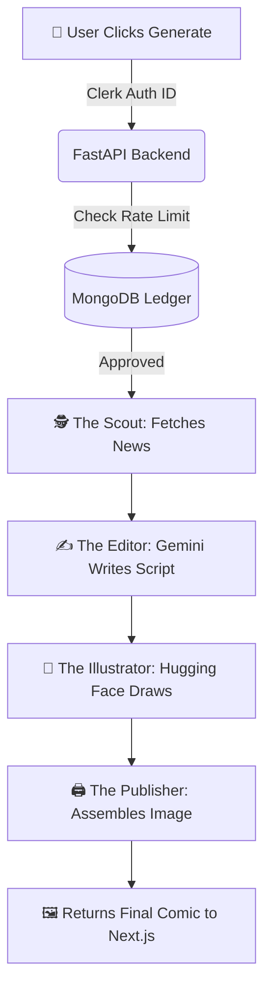

# 🚀 DailySatire.ai

### 🧠 An Autonomous Agentic AI Comic Factory

<p align="center">
<a href="YOUR_LIVE_LINK_HERE" target="_blank">

</a>
</p>

<p align="center">


</p>

---

## ✨ Overview

**DailySatire.ai** is a full-stack, multi-agent AI application that autonomously transforms **live Indian political news into single-panel Hinglish comic strips**.

Instead of a single AI prompt, this project utilizes an **Agentic Architecture** where four specialized AI personas (The Scout, The Editor, The Illustrator, and The Publisher) hand off data to one another in a seamless, automated pipeline.

> 📰 **Breaking News** → 📝 **Hinglish Satire** → 🎨 **Image Generation** → 🖼️ **Final Comic**

---

## 🧩 Key Features

🔥 **Multi-Agent Pipeline**

- **The Scout:** Scours the web for the top trending political headlines.  
- **The Editor:** Uses Google Gemini to write biting, culturally relevant Hinglish satire.  
- **The Illustrator:** Calls Hugging Face's open-source models to generate caricature art.  
- **The Publisher:** Uses Python imaging libraries to stitch the text and image into a final comic strip.

🔐 **Production-Ready Security**

- Fully integrated with **Clerk** for seamless user authentication (Google & Email).  
- Secure API routes protecting the generative models.

📊 **Smart Rate Limiting**

- **MongoDB** integration tracks daily usage per user.  
- Enforces a strict 5-comics-per-day limit to prevent API abuse and manage free-tier limits.

✨ **Stunning UI/UX**

- Built on Next.js 16 with Turbopack.  
- Glassmorphism design system with fluid **Framer Motion** loading states and an interactive `<Antigravity />` particle background.

---

## 🔄 The Agentic Flow



---

## 🏗️ Project Structure

This is a Monorepo containing both the React frontend and the Python backend.

```bash
DailySatire/
│
├── 🔧 Backend/              # Python FastAPI Server
│   ├── api.py               # Main API routes & Rate Limiter
│   ├── agents/              # The AI Personas (Scout, Editor, etc.)
│   ├── utils/               # Image generation & assembly logic
│   ├── output/              # Temporary storage for generated panels
│   └── requirements.txt
│
└── 🎨 Frontend/             # Next.js Web App
    └── comic-frontend/
        ├── app/             # App Router pages & Layout
        ├── components/      # UI, Navbar, and ComicGenerator widget
        ├── middleware.ts    # Clerk Auth protection
        └── package.json
```

---

## 🚀 Local Development Setup

### 1. Backend Setup (Python / FastAPI)

```bash
cd Backend
python -m venv venv
source venv/bin/activate  # On Windows use: .\venv\Scripts\activate
pip install -r requirements.txt
```

Create a `.env` file in the `Backend` folder:

```env
GEMINI_API_KEY="your_gemini_key"
HUGGINGFACE_API_KEY="your_hf_key"
MONGODB_URI="mongodb+srv://..."
```

Run the server:

```bash
uvicorn api:app --reload
# 🔗 Runs on: http://127.0.0.1:8000
```

### 2. Frontend Setup (Next.js)

```bash
cd Frontend/comic-frontend
npm install
```

Create a `.env.local` file in the `comic-frontend` folder:

```env
NEXT_PUBLIC_CLERK_PUBLISHABLE_KEY="pk_test_..."
CLERK_SECRET_KEY="sk_test_..."
NEXT_PUBLIC_API_URL="http://127.0.0.1:8000"
```

Run the frontend:

```bash
npm run dev
# 🌐 Runs on: http://localhost:3000
```

---

## 💡 Future Improvements

- [ ] **My Gallery:** A personalized dashboard to view previously generated comics.  
- [ ] **Model Upgrades:** Swap the Hugging Face base model to FLUX.1 or Animagine XL for cinematic art styles.  
- [ ] **Voice Narration:** Add an ElevenLabs agent to read the Hinglish punchlines out loud.

---

<p align="center">
<b>Built with ❤️ by <a href="https://github.com/YOUR_GITHUB_USERNAME">Saksham Sharma</a></b><br>
<i>"AI + Creativity"</i>
</p>
