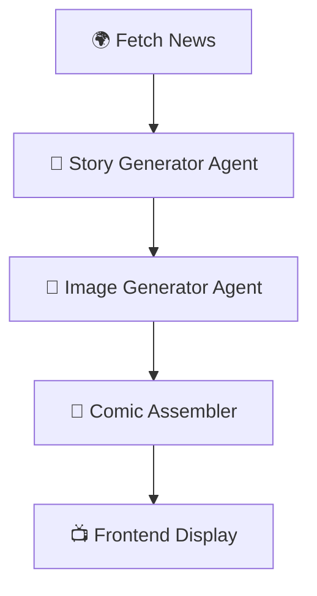

Here’s a **clean, aesthetic, “wow” GitHub README** with badges, emojis, structure, and a professional vibe 👇

---

# 🚀 DailySatire.AI

### 🧠 Agentic AI Comic & Story Generator

<p align="center">
  
  
  
  
  
</p>

---

## ✨ Overview

**COMIC-AI** is a full-stack, agent-driven AI application that transforms **real-world news into engaging comic stories** using intelligent agents, text generation, and image synthesis.

> ⚡ From breaking news → story → panels → comic
> All automated using AI agents.

---

## 🧩 Features

🔥 **Agentic Architecture**

* Multi-agent pipeline (News → Story → Image → Comic)

📰 **Live News Processing**

* Fetches trending/global news dynamically

🎭 **Story Generation**

* Converts news into engaging narratives

🎨 **AI Image Generation**

* Creates comic-style visuals for each panel

🧵 **Comic Stitching**

* Automatically assembles panels into a final comic

🌐 **Full Stack App**

* FastAPI backend + Next.js frontend

---

## 🏗️ Project Structure

```bash
COMIC-AI/
│
├── 🔧 Backend/
│   ├── api.py
│   ├── main.py
│   ├── requirements.txt
│   ├── agents/        # 🧠 AI agents
│   ├── utils/         # ⚙️ Helper functions
│   └── output/        # 🖼️ Generated comics
│
└── 🎨 Frontend/
    └── comic-frontend/
        ├── app/           # Pages & routing
        ├── components/    # UI components
        ├── lib/           # Utilities
        ├── models/        # DB models
        ├── public/        # Assets
        └── package.json
```

---

## ⚙️ Backend Setup (FastAPI)

```bash
cd Backend
pip install -r requirements.txt
uvicorn api:app --reload
```

🔗 Runs on: `http://127.0.0.1:8000`

---

## 💻 Frontend Setup (Next.js)

```bash
cd Frontend/comic-frontend
npm install
npm run dev
```

🌐 Runs on: `http://localhost:3000`

---

## 🔄 How It Works



---

## 🔐 Environment Variables

### Backend `.env`

```
OPENAI_API_KEY=your_key_here
OTHER_API_KEYS=...
```

### Frontend `.env.local`

```
NEXT_PUBLIC_API_URL=http://localhost:8000
```

---

## 📸 Demo Flow

1. User opens frontend
2. Clicks generate comic
3. Backend agents activate
4. Comic is generated and displayed

---

## 🤝 Contributing

We love contributions ❤️

```bash
# Fork the repo
# Create your feature branch
git checkout -b feature/amazing-feature

# Commit changes
git commit -m "Add amazing feature"

# Push
git push origin feature/amazing-feature
```

Then open a Pull Request 🚀

---

## 🧠 Tech Stack

* ⚡ FastAPI
* ⚛️ Next.js
* 🎨 React + TypeScript
* 🤖 OpenAI / GenAI APIs
* 🧩 Agent-based architecture

---

## 📜 License

📝 MIT License — feel free to use, modify, and build on top of this.

---

## 🙌 Acknowledgements

* FastAPI ⚡
* Next.js 🚀
* React ⚛️
* OpenAI 🤖

---

## 💡 Future Improvements

* 🎥 Animated comics
* 🗣️ Voice narration
* 📱 Mobile optimization
* 🧠 Smarter agent chaining

---

<p align="center">
  <b>Built with ❤️ by developers who love AI + Creativity</b>
</p>

---

If you want next-level upgrade (like **preview GIFs, dark theme banner, or portfolio-grade README**), tell me — I’ll make it 🔥
