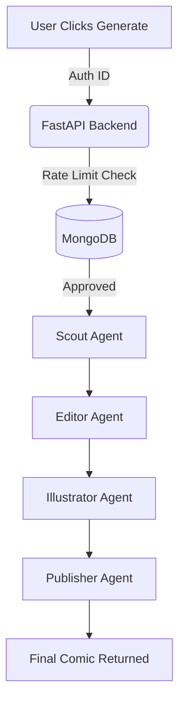

# 🚀 DailySatire.ai

### 🧠 Autonomous Agentic AI Comic Factory

<p align="center">
  <a href="YOUR_LIVE_LINK_HERE" target="_blank">
    
  </a>
</p>

<p align="center">
  
  
  
  
  
</p>

---

## ✨ What is DailySatire.ai?

**DailySatire.ai** is a full-stack **multi-agent AI system** that converts **live Indian political news → Hinglish satire → AI-generated comics** — completely autonomously.

Unlike traditional apps using a single LLM call, this project demonstrates a **true agentic pipeline**, where multiple specialized AI agents collaborate to produce a final output.

> 📰 News → ✍️ Satire → 🎨 Image → 🖼️ Comic

---

## 🧠 Why This Project Stands Out

- ✅ Real-world **Agentic AI architecture**
- ✅ Multi-step **AI orchestration pipeline**
- ✅ Combines **LLMs + Image Generation + Backend Logic**
- ✅ Production-ready features (Auth, Rate Limiting, UI)
- ✅ Strong **resume + internship-level project**

---

## ⚙️ Core Features

### 🔥 Multi-Agent Pipeline

| Agent | Role |
|------|------|
| 🕵️ **Scout** | Fetches trending political news |
| ✍️ **Editor** | Converts news → Hinglish satire (Gemini) |
| 🎨 **Illustrator** | Generates comic-style images (Hugging Face) |
| 🖨️ **Publisher** | Combines text + image into final comic |

---

### 🔐 Authentication & Security
- Clerk-based authentication (Google + Email)
- Protected backend API routes

---

### 📊 Smart Rate Limiting
- MongoDB-based usage tracking
- 5 comics/day/user limit (prevents abuse)

---

### 🎨 UI/UX
- Next.js 16 + Turbopack
- Glassmorphism design
- Framer Motion animations
- Custom `<Antigravity />` particle background

---

## 🔄 Agent Workflow



---

## 🏗️ Project Structure

```bash
DailySatire/
│
├── Backend/                # FastAPI server
│   ├── api.py
│   ├── agents/             # AI agents (Scout, Editor, etc.)
│   ├── utils/              # Image + processing logic
│   ├── output/             # Generated comics
│   └── requirements.txt
│
└── Frontend/               # Next.js app
    └── comic-frontend/
        ├── app/
        ├── components/
        ├── middleware.ts
        └── package.json
```

---

## 🚀 Local Setup

### 🔧 Backend

```bash
cd Backend
python -m venv venv
source venv/bin/activate
pip install -r requirements.txt
```

`.env`
```env
GEMINI_API_KEY=your_key
HUGGINGFACE_API_KEY=your_key
MONGODB_URI=your_uri
```

```bash
uvicorn api:app --reload
```

---

### 🎨 Frontend

```bash
cd Frontend/comic-frontend
npm install
```

`.env.local`
```env
NEXT_PUBLIC_CLERK_PUBLISHABLE_KEY=pk_...
CLERK_SECRET_KEY=sk_...
NEXT_PUBLIC_API_URL=http://127.0.0.1:8000
```

```bash
npm run dev
```

---

## 💡 Future Roadmap

- [ ] 🖼️ User comic gallery dashboard  
- [ ] 🎨 Better models (FLUX / Animagine XL)  
- [ ] 🔊 Voice narration (ElevenLabs)  
- [ ] 📱 Mobile responsiveness improvements  
- [ ] ⚡ Streaming responses (faster UX)

---

## 🧑‍💻 Author

<p align="center">
  <b>Saksham Sharma</b><br>
  <a href="https://github.com/YOUR_GITHUB_USERNAME">GitHub</a>
</p>

<p align="center">
  <i>Building at the intersection of AI + Creativity</i>
</p>

---

## ⭐ Support

If you found this project interesting:
- ⭐ Star the repo  
- 🍴 Fork it  
- 🧠 Contribute ideas  

---
